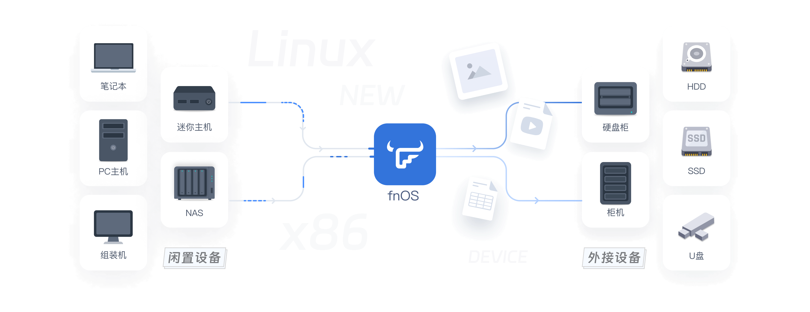
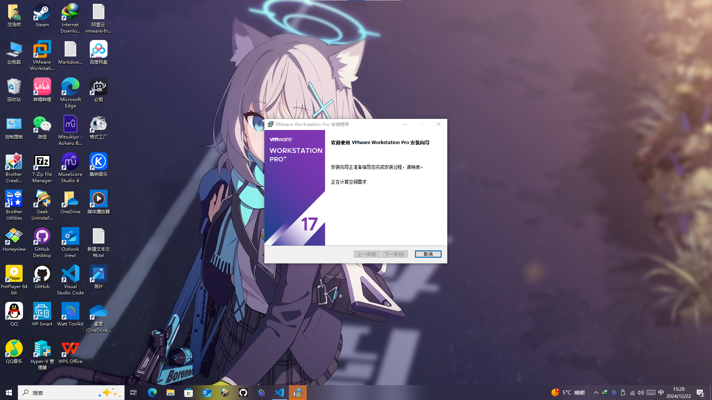
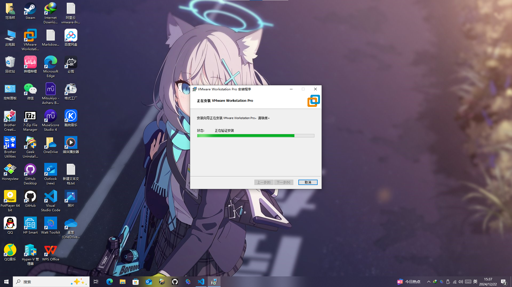
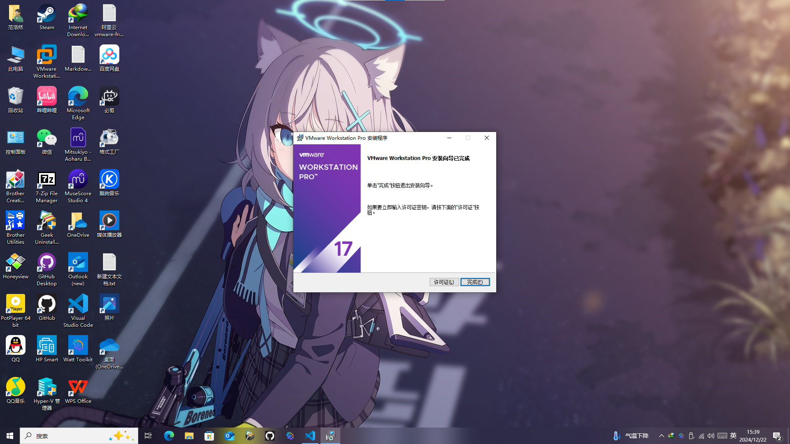

# fnos安装教程和评测

飞牛私有云（fnOS）是一款基于最新Linux内核深度开发的操作系统，兼容多种主流x86硬件，致力于提供高性能存储解决方案。该系统支持从闲置设备改造为NAS，并提供智能影视和照片备份功能，可以实现自动下载和管理媒体资源。其应用中心提供多种实用应用，方便用户探索和使用，适合家庭用户的简单易用性。

## fnOS的优点

+ 硬件兼容性强：基于最新的Linux内核（Debian发行版）深度开发，兼容主流x86硬件，用户可以将闲置的NAS或PC设备重新利用。

+ 灵活扩展：支持所有外接存储协议，用户可以根据需求灵活扩展存储空间。

+ 高性能：内核级高性能文件聚合方案，提供优越的存储性能。

+ 智能影视功能：支持远程下载和自动整理影视资源，准确率高达99%，并能自动下载字幕，兼容多种硬件和格式。

+ 相册备份：用户可以随时备份手机照片，释放手机空间，并与家人朋友共享美好时光，支持多种RAW格式的预览。

+ 丰富的应用中心：提供多种实用应用，用户可以轻松扩展系统功能，满足不同需求。

+ 简单易用：界面友好，适合家庭用户，老少皆宜。

+ 正版免费：系统是正版免费软件，专为个人用户设计，不得用于商业用途。

## fnOS下载和安装

fnOS提供了非常方便的安装方式，简直就是“傻瓜式”安装，接下来是安装步骤（我这里用VM Ware演示，物理电脑安装请转到 [这里](https://github.com/fanfan-2011/YingJiankongtianya/blob/main/01/fnos%E7%89%A9%E7%90%86%E7%94%B5%E8%84%91%E5%AE%89%E8%A3%85%E6%96%B9%E6%B3%95.md)）

### 安装VM Ware

VM Ware安装包可以到 [VM Ware官网](https://www.vmware.com/) 下载安装
如果找不到的话可以在 [联想应用商店](https://lestore.lenovo.com/detail/21600) 里下载最新版（都是正版）
![alt text][image]

1. 打开安装包，

[image]: image.png

下一步，勾选“我接受”
剩下的一路默认即可，等待安装完成即可

